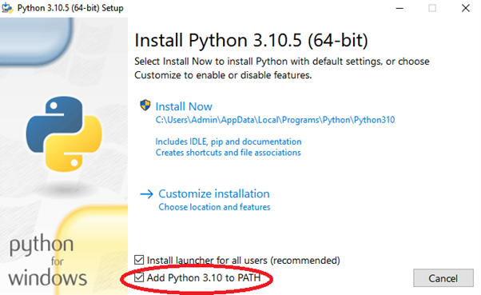

# GIC-Track
This dashboard is designed for the spatial and temporal analysis of fluorescently tagged transcription factors within cell nuclei.

# Installation Guide
1. Download Python from https://www.python.org/ftp/python/3.10.5/python-3.10.5-amd64.exe.
2. Run the Python installer file. Make sure to tick the “Add Python 3.10 to PATH” as shown in figure below before selecting “Install Now”. 

  

3. Once finished, run the “Requirements.bat” attached to install the required Python libraries.

# Requirement
This dashboard requires MATLAB with Statictics and Curve Fitting toolbox installed.
